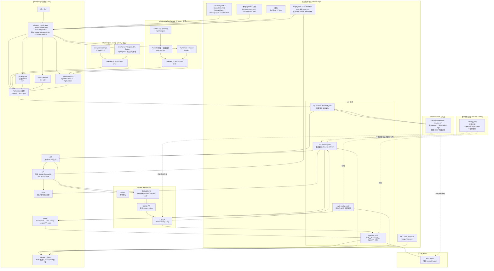

# gen-openapi：契约驱动的华为云 APIG OpenAPI 生成方案

## 背景与目标

我们的基础设施场景需要让每个服务对接华为云 APIG，并被 AI Agent / 文档系统 / 内部目录自动发现。每个服务都需要一份满足华为云 APIG 导入格式的 `openAPI.yaml`，但不希望靠人工手写、长期维护一堆 YAML。

如果直接靠源码扫描或 AI 猜，会出现：

- Java / Python / Go 多语言生成质量不一致
- APIG 网关地址、认证策略、后端域名无法可靠推断
- 内部接口（如 `/debug`、`/metrics`、`/internal/reload`）可能被误暴露
- 调试接口与生产接口边界混乱
- 生成结果不稳定、不可审计

最终的目标是：

> **每个服务在仓库内维护一份显式 API 契约，作为 source of truth；`gen-openapi` 确定性地把契约编译成华为云 APIG OpenAPI 3.0.3；扫描器与 Agent 只生成候选修改，所有变更通过 PR 由服务 owner 审核。**

---

## 业界架构参考

### Google — API Improvement Proposals (AIP) 与 GAPIC

Google 内部以 proto + AIP 注解作为 API 真相源，由 GAPIC 生成器编译出客户端 SDK、文档、网关配置。我们借鉴其核心理念：

- **API 定义优先**:每个 API 显式定义边界
- **确定性生成**：同样输入生成同样输出
- **代码生成器不依赖环境变量**
- **强兼容性约束**

> 参考：[Google AIP](https://google.aip.dev/)、[AIP-4210 Client library generators](https://google.aip.dev/client-libraries/4210)

### Spotify — Backstage Software Catalog

Spotify 把每个服务的 `catalog-info.yaml` 与源码共存，再由集中 Catalog 索引聚合所有服务、API 与所有权关系。我们采用同样的“分布式契约 + 集中索引”模型。

> 参考：[Backstage Software Catalog](https://backstage.io/docs/features/software-catalog/descriptor-format/)

### OpenAPI Generator

CI Pipeline + CLI 是被业界大规模验证的 OpenAPI 工程实践。我们沿用这一模式。

> 参考：[OpenAPI Generator](https://openapi-generator.tech/)

---

## 架构概览

最终架构采用 **Go 主控 + 语言原生适配器 + 统一契约治理**：

- `gen-openapi` 主项目继续用 Go 实现，负责 CLI、统一 `ApiContract`、OpenAPI 导入、华为云 APIG 渲染、`diff/apply/pr`、CI 工作流与发布治理。
- Go / Java / Python 统一采用 `discover --mode auto` pipeline：**runtime OpenAPI 优先，其次本地 OpenAPI 文件，再其次语言原生静态分析，最后 legacy fallback**。
- OpenAPI 3.x/3.1 是唯一的 API spec 主标准。
- Go、Java、Python 都先尝试 runtime OpenAPI endpoint：Go 可探测 `/openapi.json`、`/openapi.yaml` 等；Java Spring 常见为 `/v3/api-docs`；Python FastAPI 常见为 `/openapi.json` / `app.openapi()`。
- 没有 runtime/local spec 时，当前 Go core 只内置 **Go/Gin 轻量 AST 静态发现**；Java / Python 静态 adapter 作为后续扩展能力，需要时再单独加入。
- AI 增强作为可选阶段，通过 Gemini Code Assist / Gemini API 分析无注解代码与上下文，补全 summary、description、tags、review notes 和风险提示，但不作为生产真相源。
- Java / Python adapter 不直接生成生产 `openAPI.yaml`；它们只输出 OpenAPI 或 `ApiContract` 候选，最终必须回到 Go core 做校验、归一化、diff、PR、render。



数据流：

```text
源码 / Runtime OpenAPI / 本地 OpenAPI / 轻量 Go/Gin 静态扫描或后续 adapter
        ↓（discover --mode auto：runtime OpenAPI → local OpenAPI → Go/Gin scanner 或后续 adapter）
OpenAPI 或 ApiContract draft
        ↓（Go core 统一导入、校验、归一化）
api-contract.detected.yaml   候选
        ↓（可选 Gemini AI 增强，只补语义与说明）
api-contract.detected.yaml   增强候选
        ↓（diff / pr / owner review）
api-contract.yaml            正式契约
        +
apig-config.yaml             部署配置
        ↓（Go deterministic renderer）
openAPI.yaml                  APIG 导入文件
        ↓（apig-import：Huawei Go SDK，凭证来自环境变量）
华为云 APIG / Agent / Catalog
```

---

## 契约文件存放位置

### 决策：分布式契约 + 集中索引

| 项 | 决策 | 原因 |
|---|---|---|
| 服务 API 契约 | **每个仓库下 `api/api-contract.yaml`** | API 改动属于代码变更，自然随 PR 演进，owner 明确 |
| 服务 APIG 部署配置 | **每个仓库下 `api/apig-config.yaml`** | 与服务部署紧耦合 |
| APIG YAML 生成物 | **每个仓库下 `api/openAPI.yaml`** | 由 CLI 生成、CI 检查、APIG 导入 |
| 集中目录 | **`infra-api-catalog/` 仓库只放索引** | 只引用各仓库 contract / openAPI，避免成为瓶颈 |

不推荐把所有契约塞进一个中央仓库，原因：

- 改一个 API 需要双仓库 PR
- 中央仓库会变成所有团队的合入瓶颈
- 所有权模糊
- 难以扩展到几十上百个服务

---

## 核心设计原则

| 原则 | 说明 | 参考 |
|---|---|---|
| **显式契约即真相源** | `api-contract.yaml` 由服务 owner 维护，决定哪些 API 暴露 | Google proto/AIP |
| **声明式配置** | 部署策略写在 `apig-config.yaml`，不依赖环境变量 | AIP-4210 |
| **确定性生成** | 同样契约 + 配置永远产生同样的 `openAPI.yaml` | AIP-4210 |
| **扫描即候选** | discover/import 只生成草稿，不直接进入生产 | 防止误暴露内部接口 |
| **PR 即变更入口** | 所有契约变更通过 PR 合入 | 可审计 |
| **CI 防漂移** | check + drift scan 强制契约与代码、契约与生成物一致 | 减少人工维护 |
| **多语言一致体验** | Go / Java / Python 用同一 CLI 同一契约模型 | 统一治理 |

---

## 契约文件设计

### `api-contract.yaml`

每个服务的 API source of truth。

```yaml
apiVersion: infra.example.com/v1
kind: ApiContract
metadata:
  name: software-package-server
  title: Software Package Server API
  version: 1.0.0
  description: openEuler 软件包引入管理服务
spec:
  basePath: /api
  routes:
    - operationId: listSoftwarePackages
      method: GET
      path: /v1/softwarepkg
      summary: List software packages
      auth: none
      backendPath: /api/v1/softwarepkg
      parameters:
        - name: page_num
          in: query
          type: integer

    - operationId: applyNewSoftwarePackage
      method: POST
      path: /v1/softwarepkg
      summary: Apply a new software package
      auth: app
      backendPath: /api/v1/softwarepkg
      requestBody:
        schema: SoftwarePkgRequest
        required: true
  schemas:
    SoftwarePkgRequest:
      type: object
      required: [pkg_name, desc, reason, upstream, spec_url, src_rpm_url, sig, branch, repo_link]
      properties:
        pkg_name: { type: string }
        desc: { type: string }
```

### `apig-config.yaml`

部署目标配置。不包含真实密钥。

```yaml
apiVersion: infra.example.com/v1
kind: HuaweiApigConfig
metadata:
  name: software-package-server-apig
spec:
  gatewayUrl: https://xxx.apic.ap-southeast-1.huaweicloudapis.com
  backend:
    type: HTTP
    scheme: https
    address: software-pkg.test.osinfra.cn
    timeout: 5000
    retryCount: "0"
  defaults:
    cors: false
    sendFgBodyBase64: true
    matchMode: NORMAL
    requestType: public
    securityScheme: apig-auth-app-header
  securitySchemes:
    apig-auth-app-header:
      type: AppSigv1
      in: header
      name: Authorization
      appcodeAuthType: header
```

### `api-contract.detected.yaml`

由扫描器生成的候选契约，仅用于差异对比，**不作为生产 source of truth**。

### `openAPI.yaml`

`gen-openapi render` 的输出，华为云 APIG 可直接导入。

---

## CLI 命令一览

```
gen-openapi
├── init               初始化契约和 APIG 配置模板
├── render             contract + apig-config → openAPI.yaml
├── validate           校验 openAPI.yaml 是否符合 APIG 格式
├── check              检查 openAPI.yaml 是否过期（render drift）
├── discover           OpenAPI-first 发现；无 spec 时 fallback 到 Go/Gin 轻量 AST 扫描
│   └── --lang go --framework gin
├── import-openapi     已有 OpenAPI 3.x（springdoc / FastAPI）→ 候选契约
├── apig-import        render + validate + Huawei Go SDK 直连导入 APIG
├── diff               candidate vs contract 差异
├── apply              保守合入 detected → canonical contract
└── pr                 自动创建 review PR（禁止 auto-merge）
```

### 漂移检测的三类检查

| 检查 | 比较对象 | 目的 |
|---|---|---|
| **render drift** (`check`) | `contract + apig-config` vs `openAPI.yaml` | 生成物未及时更新 |
| **contract drift** (`discover + diff`) | 源码扫描结果 vs `api-contract.yaml` | 代码改了但契约未同步 |
| **APIG validation** (`validate`) | `openAPI.yaml` 自身 | 缺字段、不合法的 APIG 配置 |

---

## 多语言适配器策略

`gen-openapi` 用 Go 实现主控与治理，但语言理解交给对应生态里最强的工具。部署上采用 **Go core 必装、Java/Python adapter 按需启用** 的模式，避免所有服务都被迫安装三套语言运行时。

所有语言统一走 `discover --mode auto`。OpenAPI 3.x/3.1 是唯一 API spec 主标准：

| 顺序 | 来源 | Go | Java Spring | Python FastAPI |
|---|---|---|---|---|
| 1 | Runtime OpenAPI endpoint | `/openapi.json`、`/openapi.yaml` | `/v3/api-docs` | `/openapi.json` / `app.openapi()` |
| 2 | 本地 OpenAPI 文件 | `docs/openapi.yaml`、`docs/openapi.json` | `docs/openapi.yaml`、`docs/openapi.json` | `docs/openapi.yaml`、`docs/openapi.json` |
| 3 | 语言原生静态分析 | 轻量 `go/ast` Gin scanner | 后续 adapter 扩展 | 后续 adapter 扩展 |
| 4 | Legacy fallback | Gin regex scanner | 不内置 | 不内置 |

### Go 仓库

| 子模式 | 优先级 | 来源 | 说明 |
|---|---|---|---|
| Runtime OpenAPI 探测 | **首选** | `--base-url` / `--openapi-url`，探测 `/openapi.json`、`/openapi.yaml` 等 | 与 Java/Python 使用同一流程；Go 如果集成 huma / goa / ogen / OpenAPI endpoint 等，应优先使用运行时真实 OpenAPI |
| 本地 OpenAPI 文件 | 高 | `import-openapi` | 兼容已有 `docs/openapi.yaml`、`docs/openapi.json` 等文件；`import-openapi` 是底层导入能力，不是主发现入口 |
| Go 原生静态分析 | 当前主线 fallback | 轻量 `go/ast` | 当没有 runtime/local spec 时，保守识别常见 Gin 路由、group prefix 与 path 参数 |
| Regex Gin 扫描 | 最后 fallback | 当前 `discover --lang go --framework gin` | 只保留为低依赖兜底，不作为主输出路径 |

### Java 仓库（Spring Boot）

| 子模式 | 优先级 | 来源 | 说明 |
|---|---|---|---|
| springdoc-openapi `/v3/api-docs` | **首选** | `import-openapi --input http://localhost:8080/v3/api-docs` | 框架运行时生成的真实 OpenAPI，最接近实际路由和 schema |
| Java Spring adapter runtime mode | 后续扩展 | `adapters/java-spring/` | 可自动启动服务、等待端口、抓取 `/v3/api-docs`、输出 OpenAPI / ApiContract draft |
| Java AST 静态补强 | 后续扩展 | JavaParser / Eclipse JDT / Spoon | 理解 Spring 注解、DTO、泛型、`ResponseEntity<T>`、Bean Validation、Jackson、Lombok 等信息 |
| 静态 fallback | 当前不内置 | - | 需要时再新增 Java adapter，不在 Go core 内保留临时 regex scanner |

### Python 仓库（FastAPI）

| 子模式 | 优先级 | 来源 | 说明 |
|---|---|---|---|
| FastAPI 原生 OpenAPI | **首选** | `app.openapi()` / `/openapi.json` | 利用类型提示与 Pydantic 模型零配置生成 OpenAPI 3.1 |
| Python FastAPI adapter runtime mode | 后续扩展 | `adapters/python-fastapi/` | 自动定位/import FastAPI app，调用 `app.openapi()`，处理 Pydantic v1/v2 差异 |
| Python AST / inspect fallback | 后续扩展 | Python `ast` / `inspect` | 无法运行服务时补充 decorator、函数签名、模型引用 |
| 静态 fallback | 当前不内置 | - | 需要时再新增 Python adapter，不在 Go core 内保留临时 regex scanner |

> FastAPI 默认输出 OpenAPI 3.1；Go core 的 `import-openapi` 负责归一化为 `ApiContract`，并在 `render` 时输出华为云 APIG 需要的 OpenAPI 3.0.3。

### Adapter 输出协议

语言 adapter 不生成最终生产 `openAPI.yaml`。它们只允许输出两类候选输入：

1. **OpenAPI 3.x/3.1**：适合 springdoc / FastAPI runtime 模式，再由 Go core 执行 `import-openapi`。
2. **ApiContract draft**：适合 AST/static analysis 模式，再由 Go core 执行 `LoadContractLoose`、归一化和校验。

统一交汇点固定为：

```text
adapter output / import output
        ↓（Go core normalize + validate）
api-contract.detected.yaml   候选
        ↓（diff / apply / pr / owner review）
api-contract.yaml            正式 source of truth
        ↓（Go deterministic render）
openAPI.yaml                  APIG 导入文件
```

这是多语言治理统一的关键：**adapter 负责发现，Go core 负责治理和生产产物**。

---

## 维护流程（事件驱动 + 定时兜底）

### 1. 开发者改 API（事件驱动）

```
开发者修改路由或 handler
        ↓
PR 提交
        ↓
CI 运行 gen-openapi discover + diff
        ↓
若 contract 未同步：CI fail，提示更新
        ↓
开发者更新 api-contract.yaml
        ↓
CI 运行 gen-openapi check 确认 openAPI.yaml 同步
        ↓
PR 合入
```

### 2. 平台定时扫描（兜底）

```
定时任务（每日凌晨）扫描生产分支
        ↓
gen-openapi discover
        ↓
gen-openapi diff
        ↓
有差异：自动创建 Issue / PR
        ↓
服务 owner review 后合入
```

### 3. 漂移修复 PR 由人合入

PR 自动创建，但**禁止自动合入**，避免 `/debug/pprof`、`/metrics`、`/internal/reload` 等接口被无人审查地暴露。

PR 文案示例：

```
chore: sync API contract with discovered routes

新增候选接口：
+ POST /v1/softwarepkg/{id}/approve

移除候选接口：
- PUT /v1/softwarepkg/{id}/retest

参数变化：
~ GET /v1/softwarepkg 新增 query 参数 sig

未纳入候选（请人工确认是否暴露）：
* GET /debug/pprof
* GET /metrics
```

---

## CI 模板

每个服务仓库挂两个 workflow。

### PR 检查 `apig-check.yml`

```yaml
on:
  pull_request:
    branches: [main]
    paths:
      - 'api/**'
      - '**/*.go'
      - '**/*.java'
      - '**/*.py'

jobs:
  check:
    runs-on: ubuntu-latest
    steps:
      - uses: actions/checkout@v4
      - uses: actions/setup-go@v4
        with: { go-version: '1.22' }
      - run: go install your-org/gen-openapi@latest
      - run: |
          gen-openapi check \
            --contract api/api-contract.yaml \
            --apig-config api/apig-config.yaml \
            --output api/openAPI.yaml
```

### 定时漂移扫描 `apig-drift-scan.yml`

```yaml
on:
  schedule:
    - cron: '0 2 * * *'
  workflow_dispatch:

jobs:
  drift:
    runs-on: ubuntu-latest
    steps:
      - uses: actions/checkout@v4
      - run: go install your-org/gen-openapi@latest
      - run: |
          gen-openapi discover \
            --source . \
            --lang go \
            --framework gin \
            --out /tmp/api-contract.detected.yaml
      - run: |
          gen-openapi diff \
            --contract api/api-contract.yaml \
            --detected /tmp/api-contract.detected.yaml \
            --suggest-pr
      # 可选：自动开 PR（不自动 merge）
```

---

## 集中索引：`infra-api-catalog`

```yaml
apiVersion: infra.example.com/v1
kind: ApiCatalog
metadata:
  name: infrastructure-api-catalog
spec:
  services:
    - name: software-package-server
      owner: infra-package-team
      language: go
      lifecycle: production
      repo: https://git.example.com/infra/software-package-server
      contract: api/api-contract.yaml
      apigConfig: api/apig-config.yaml
      apigYaml: api/openAPI.yaml

    - name: image-builder
      owner: infra-image-team
      language: java
      lifecycle: production
      repo: https://git.example.com/infra/image-builder
      apigYaml: api/openAPI.yaml

    - name: vm-manager
      owner: infra-compute-team
      language: python
      lifecycle: beta
      repo: https://git.example.com/infra/vm-manager
      apigYaml: api/openAPI.yaml
```

Catalog 只记录引用，不复制契约本身。后续可被 Agent / 文档系统 / APIG 批量发布消费。

---

## Agent 在体系中的定位

| 维度 | 是否使用 Agent | 说明 |
|---|---|---|
| 生产 `openAPI.yaml` 链路 | 不使用 | 必须确定性 |
| 扫描候选生成 | 可使用 | 例如补 summary/description |
| 差异解释 | 可使用 | 给 PR 评论加上自然语言解释 |
| 自动开 PR | 可使用 | 但禁止自动合入 |
| 决策是否暴露内部接口 | 不使用 | 必须人工判断 |

---

## 与现有工具的关系

| 工具 | 关系 |
|---|---|
| springdoc-openapi | Java Spring Boot 运行时 OpenAPI；`import-openapi` 抓取 `/v3/api-docs` |
| FastAPI 内置 OpenAPI | Python FastAPI 原生 OpenAPI 3.1；`import-openapi` 抓取 `/openapi.json` 并转 3.0.3 |
| OpenAPI Generator | 反向工具（spec → code），与本项目互补 |
| gnostic / google-discovery-to-openapi | Google Discovery → OpenAPI 转换，可作为未来 `import-discovery` 适配器 |
| Backstage Software Catalog | 我们的 `infra-api-catalog` 与之同构，未来可直接对接 |
| Gemini Code Assist / Claude / Codex | 作为 Agent 增强源码理解，仅生成候选，不进入生产链路 |

---

## 试点：software-package-server

本次以 [opensourceways/software-package-server](https://github.com/opensourceways/software-package-server) 作为首个试点。

输入：

- 真实 Gin 路由在 `server/gin.go` 与 `softwarepkg/controller/*.go`
- 认证 header：`TOKEN` / `PRIVATE-TOKEN` / `_Y_G_` cookie

预期产出（放在该仓库 `apig/` 目录）：

- `apig/api-contract.yaml`
- `apig/apig-config.yaml`
- `apig/openAPI.yaml`

本项目不再提交完整 `examples/` 目录；CLI 端到端测试夹具保留在 `internal/testdata/software-package-server/`。

试点链路：

```
software-package-server runtime/local OpenAPI
        ↓ gen-openapi import-openapi
api/api-contract.yaml (候选→正式)
        +
api/apig-config.yaml (人工填写部署配置)
        ↓ gen-openapi render
api/openAPI.yaml
        ↓ gen-openapi validate
导入华为云 APIG
```

后续接入：

- Java Spring Boot 服务：复用 springdoc `/v3/api-docs`
- Python FastAPI 服务：复用 `/openapi.json`

---

## Roadmap

### Phase 1：确定性底座（已完成）

- [x] `gen-openapi init`
- [x] `gen-openapi render`
- [x] `gen-openapi validate`
- [x] `internal/testdata/software-package-server/` 端到端测试夹具跑通

### Phase 2：漂移检测与导入 MVP（已完成）

- [x] `gen-openapi check`（render drift）
- [x] `gen-openapi import-openapi`（适配 springdoc / FastAPI runtime OpenAPI）
- [x] PR 检查模板：`apig-check.yml`
- [x] 定时漂移扫描模板：`apig-drift-scan.yml`

### Phase 3：候选发现与 Review 闭环 MVP（已完成）

- [x] `gen-openapi discover --lang go --framework gin`（轻量 Gin AST analyzer + regex fallback）
- [x] Java/Spring、Python/FastAPI 通过 `import-openapi` 或 `discover --mode auto` 消费 runtime/local OpenAPI；Go core 不内置临时静态 scanner
- [x] `gen-openapi diff`
- [x] `gen-openapi apply`
- [x] `gen-openapi pr`（自动创建 Review PR，禁止 auto-merge）
- [x] `cmd/` RunE smoke tests + `NewRootCommand()` fresh command factory

### Phase 4：目标分析架构（下一步主线）

- [x] `discover --mode auto` P1：`--openapi-url` → `--base-url` runtime probes → local OpenAPI docs → 当前 regex fallback
- [x] Go runtime API spec 探测 P1：支持 `--openapi-url` / `--base-url`，探测 `/openapi.json`、`/openapi.yaml` 等
- [x] Go 原生静态分析器：轻量 Gin AST scanner 已支持 route/group prefix/path 参数，并保留 regex fallback
- [ ] Go 静态分析后续增强：按需补充更精准类型校验、Echo/Chi、response schema、middleware auth 提示
- [ ] Java Spring adapter：后续按需新增 springdoc runtime mode + JavaParser / Eclipse JDT / Spoon 静态补强
- [ ] Python FastAPI adapter：后续按需新增 `app.openapi()` / Pydantic v1/v2 + Python `ast` / `inspect` fallback
- [ ] Adapter 输出协议：OpenAPI 3.x/3.1 或 ApiContract draft，统一回到 Go core 处理
- [x] Drift workflow 改造 P1：模板支持 `DETECT_MODE=auto`、`DETECT_OPENAPI_URL`、`DETECT_BASE_URL`，默认仍保持 static 兼容
- [ ] Gemini AI enrichment：补 summary / description / tags / drift 解释 / review checklist，只增强候选，不直接写正式契约

### Phase 5：自动化与生态

- [x] `infra-api-catalog` 集中索引仓库样板（`catalog/catalog.yaml`）
- [ ] Backstage Catalog 适配输出
- [ ] APIG 自动发布对接（导入 API、灰度、发布、回滚）
- [ ] 发布形态：Go core 单 binary + Java/Python optional adapters + CI full Docker image

---

## 一句话总结

> **每个服务在自己的仓库内维护显式 API 契约和 APIG 部署配置，`gen-openapi` 确定性生成华为云 APIG OpenAPI YAML；多语言通过适配器统一进入同一契约模型；扫描器与 Agent 只生成候选 PR，所有变更由服务 owner 审核合入；集中索引仓库只索引服务，不复制契约。**
